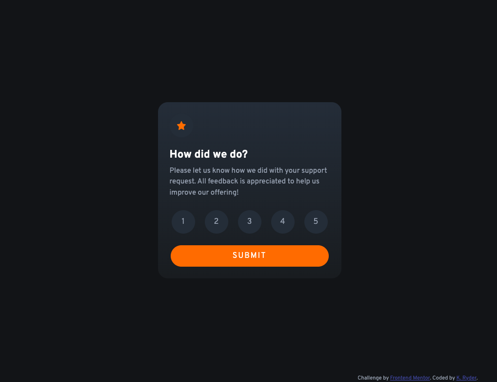
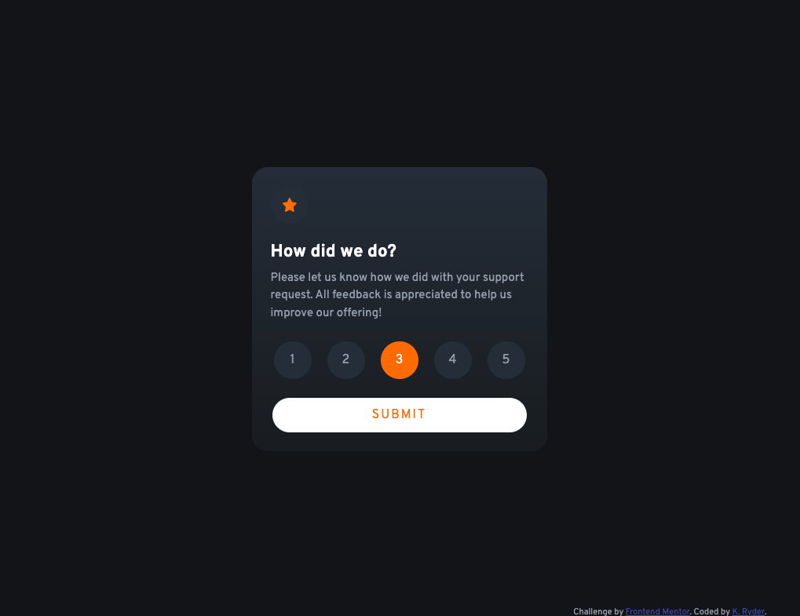
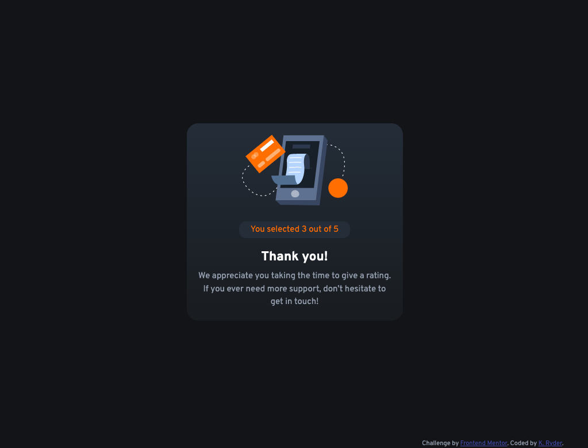

# Front End Mentor Rating Challenge
 This is a Front End Mentor Challenge, using HTML, CSS and JavaScript to build an interactive rating component.
 
## Table of contents

- [Overview](#overview)
  - [The challenge](#the-challenge)
  - [Screenshot](#screenshot)
  - [Links](#links)
- [My process](#my-process)
  - [Built with](#built-with)
  - [What I learned](#what-i-learned)
  - [Continued development](#continued-development)
  - [Useful resources](#useful-resources)
- [Author](#author)

## Overview

### The challenge

- Build out the project to the designs provided

### Screenshot





### Links

- Solution URL: [Add solution URL here](https://your-solution-url.com)

## My process

### Built with

- Semantic HTML5 markup
- CSS custom properties
- Bootstrap 5.2
- Flexbox

### What I learned

In this project I learned about using Bootstrap, especially for layout purposes, how to change the interface of radio buttons and accessing the value of the checked radio button. 

The following HTML snippet is part of the radio button structure:
```html
<section class="container-fluid">
                <form action="#" id="rating">
                    <div class="justify-content-between pb-3 m-2 row row-cols-auto" role="group"
                        aria-label="Basic radio toggle button group">
                        <input type="radio" class="btn-check" name="btnradio" id="btnradio1" value="1"
                            autocomplete="off">
                        <label class="btn btn-secondary round" for="btnradio1">1</label>
```

This is the code used to retrieve the results of the form:
```js
ratingForm.addEventListener('submit', function (e) {
    e.preventDefault();
    mainCard.classList.add('visually-hidden');
    secondaryCard.classList.remove('visually-hidden');
    let selectedRating = document.querySelector("input[name='btnradio']:checked").value;
    let finalRating = document.querySelector("#final-rating");
    finalRating.innerText = selectedRating;
})
```


### Continued development

I would like to improve on my refactoring abilities, as well as become more familiar with accessibility guidelines. 

### Useful resources

- [W3 Star Rating Example](https://www.w3.org/WAI/tutorials/forms/custom-controls/) - This helped me understand how to hide the visibility of the radio buttons while still maintaining their functionality.

## Author

- GitHub - [KRyde507](https://github.com/kryde507)